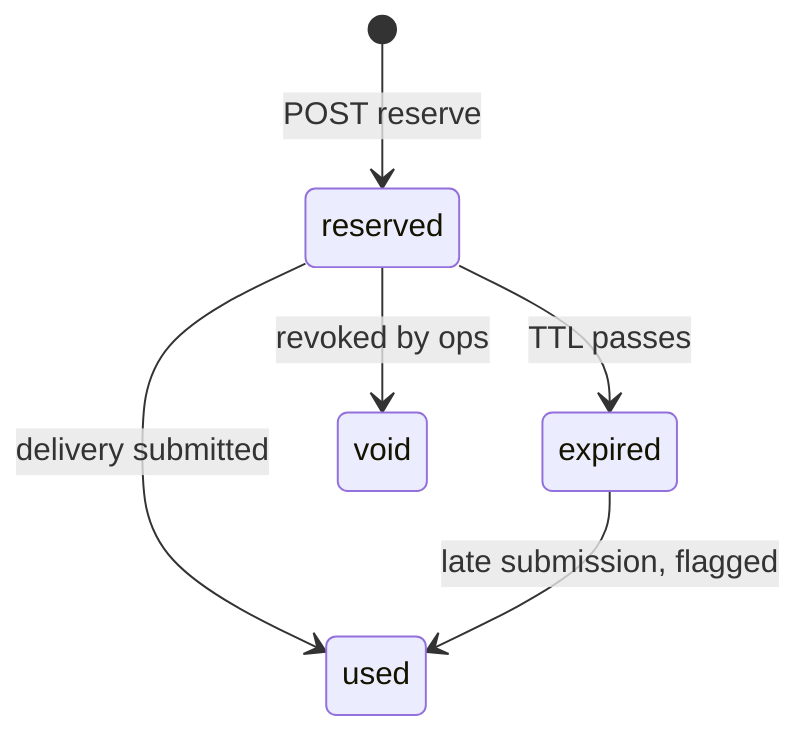
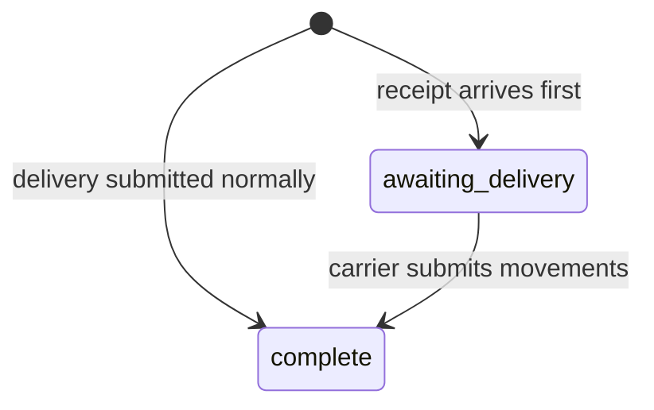

# Option A — Pre-reserved Delivery IDs

2026-09-21 · DWTC-129 / [D-028](../decisions.md#d-028)

## Spike outcome (2026-09-23)

**Status:** prototyped and manually verified locally; not yet reviewed or decided. This document started as a design proposal (drafted 2026-09-21); the sections below it are that original design, unchanged. This section reports what actually building it showed.

**What was built.** A working prototype of all four API-contract changes and the two-collection data model described below, on two branches:

- `waste-movement-backend@feat/DWTC-129-option-a-pre-reserved-delivery-ids`
- `waste-movement-external-api@feat/DWTC-129-option-a-pre-reserved-delivery-ids`

See [option-a-demo.md](option-a-demo.md) to pull and run it yourself.

**What the spike confirmed.** Every factual claim this design rests on ("What the current system actually does", below) checked out against the real code before a line was written, and held up once built: the shared per-year Movement/Delivery ID counter, `POST /receipts` already building an empty delivery shell for the no-delivery-yet case, IDs already exceeding 8 characters at current counter values, and `deliveries` genuinely having no indexes today. The mechanism works end-to-end as designed — reserve → validity check → out-of-order receipt → delivery submission → idempotent replay → conflict → wrong-org rejection — all verified manually and with Jest coverage (52 passing tests across both repos). Nothing surfaced during the build that contradicts the design below.

**What was simplified for the prototype, and must not be mistaken for the production design:**

- **Outstanding-reservation cap**: hardcoded flat 50 per org, not the self-scaling `max(50, 14 × mean daily deliveries)` formula proposed below — no real per-org volume data exists yet to derive it from.
- **Duplicate-submission handling**: an application-level find-before-insert in `services/delivery.js`, not the unique `deliveries.deliveryId` index this design calls a blocking prerequisite. A single-operator manual demo has no concurrency to expose the race this leaves open; real use would.
- **Idempotency-Key replay matching**: compares only `count`, not the full request body as described below.

**What it doesn't resolve.** None of the six items under "Decisions that are yours" was answered by building this — they're still open. Nor does the prototype implement either blocking prerequisite (unique index, 8–14 character format assumptions); it works around both for demo purposes only.

## Scope/

Option A gives a vendor a supply of Delivery IDs minted in advance, so a driver can hand one to a receiving site with no signal — and the site, which is online, can confirm at the counter that the ID is a live reservation before accepting the waste.

That last part is the whole reason to prefer reservations over letting the app generate an ID to a pattern. A generated ID can be checked for shape; only a reserved ID can be checked for existence. Everything below is in service of making that counter-time check real and keeping the outstanding stock of printed IDs bounded and traceable.

**In scope**

- A reservation endpoint and store, drawing from the existing ID counter
- A per-organisation cap on outstanding reservations, and expiry that reclaims it
- Ownership verification when a reserved ID is used to submit a delivery
- A validity lookup the receiving site calls before accepting
- The receipt-arrives-before-delivery path, which reservations make routine rather than exceptional

**Out of scope**

- The ID character format, length and alphabet — that is the sibling format spike; this design changes neither
- Reserving Movement IDs. D-028 asks the question; the recommendation here is to defer it until an offline movement-creation case is evidenced, since creation happens during arrangement, not at the roadside
- Rate limiting per client. Needed, but not specific to Option A — coupling them delays both
- Offline classification and grouping of movements, which is a separate strand of DWTC-129

## What the current system actually does

Four facts from the code shape this design more than any preference does.

**Movement and Delivery IDs share one per-year counter.** They are drawn from the same sequence, so a Delivery ID can never equal a Movement ID. That answers D-028's sub-question directly: reservations must keep drawing from the same `GET /next`, because the no-collision property is a consequence of the shared counter and nothing else. A separate reservation sequence would destroy it.

**IDs are not eight characters.** The format is `YY` + sqids with `minLength 6`, so 8 characters covers counters 1–35,936 in a year, then 9, then 10. At programme volumes the counter passes 35,936 within the first hours of January, so in practice almost every ID is 9 characters or longer. Any regex of the form `^\d{2}[A-Z0-9]{6}$` is already wrong. Printed artefacts, vendor validation and receiving-site input fields must accept 8–14.

**`POST /receipts` already creates delivery shells.** A receipt submitted with no delivery mints an ID and writes a delivery with `movementIds: []`. The out-of-order case this design needs is therefore not new machinery — it is the existing shell, reached by a different route. Option A should reuse it rather than build a parallel path.

**The `deliveries` collection has no indexes at all**, including no unique index on `deliveryId`. Today that is latent; under Option A it is dangerous, because reservations create a real window in which the same ID can be submitted twice. See the prerequisites at the end.

### Identity, and what it is good for

`apiCode` maps to a UUID `orgId` through config; the Cognito `client_id` arrives as `x-dwt-client-id` and already tags metrics as `tenant.id`. So both identities are available at every call with no new plumbing, and the telemetry to answer "who is over-pulling" partly exists already.

### A defect reservations happen to fix

When a delivery insert fails after the ID is minted, the ID is burned and only logged. Splitting minting from use makes that impossible: an ID that is reserved but never used stays visible, countable and reclaimable instead of vanishing into a log line.

## Lifecycle and states

Keep two state fields, not one. A reservation's status is about **custody of the ID**; a delivery's status is about **completeness of the record**. Folding them into a single field produces a combinatorial mess as soon as a receipt arrives before its delivery — which, offline, is the normal case rather than the exception.

### Reservation status



`expired` reclaims quota and marks the ID as stale stock. It does **not** reject a later use. Because IDs are drawn from a monotonic per-year counter and are never recycled, an expired ID is never reassigned to anyone else, so accepting it late is safe — and rejecting it would mean a driver hands over waste against an ID the site cannot receipt. That is the failure this whole option exists to prevent. The transition is recorded as `usedAfterExpiry` for reporting.

`void` exists for the one case leniency cannot cover: a batch known to be compromised or printed in error. It is an ops action, not a timer, and it does reject use.

### Delivery record state



`awaiting_delivery` is the existing empty-shell record given a name. It means the receiving site has signed for waste and the carrier has not yet said what it was. It is the state a regulator most needs to see, and the one with no defined expiry today.

### How the two combine

| Reservation | Delivery record | What has happened |
| --- | --- | --- |
| `reserved` | absent | Printed, not yet handed over |
| `reserved` | `awaiting_delivery` | Handed over and receipted; carrier still offline |
| `used` | `complete` | Normal completion |
| `expired` | absent | Stale stock; quota reclaimed |
| `expired` | `complete` | Late but accepted, flagged |

The second row is the offline case. Note that the reservation stays `reserved` there — it flips to `used` only when the **carrier** submits, because it is the carrier's custody of the ID that is being discharged, not the receiver's.

## API contract

Four changes, one of them new to this design.

### 1. Reserve a batch

`POST /deliveries/reserve` — `Idempotency-Key` header **required**.

```json
{ "count": 25 }
```

```json
{
  "reservations": [
    { "deliveryId": "26KMT4Z9A", "expiresAt": "2026-12-20T00:00:00Z" }
  ],
  "outstanding": 68,
  "cap": 140
}
```

| Code | When |
| --- | --- |
| 201 | Created |
| 400 | `count` absent, below 1 or above 100 |
| 409 `QUOTA_EXCEEDED` | Outstanding reservations would exceed the cap; body carries `outstanding` and `cap` |
| 409 `IDEMPOTENCY_CONFLICT` | Key replayed with a different body |
| 200 | Key replayed with the same body — returns the original batch, mints nothing |

Quota exhaustion is a state conflict, not a rate, so it is 409 rather than 429. Reserve 429 for the rate limiter when that lands, so vendors can tell "you are asking too fast" from "you are holding too many".

### 2. Validity lookup, for the receiving site

`GET /deliveries/{deliveryId}/validity` — **new, and the point of Option A.**

Without this the receiving site has no way to act on the fact that the ID was reserved, and Option A degrades into an expensive version of a generated ID.

```json
{ "known": true, "state": "reserved", "acceptable": true }
```

| Code | When |
| --- | --- |
| 200 | ID is known; `state` is `reserved`, `expired`, `awaiting_delivery` or `complete` |
| 404 | Not known, or voided |

`acceptable` is the single boolean a weighbridge operator's screen should act on: true for `reserved`, `expired` and `awaiting_delivery`, false only for `void`. Deliberately no carrier name in the response — see the open decision on disclosure.

### 3. Submit a delivery against a reserved ID

`POST /deliveries` gains an optional `deliveryId`. Absent, behaviour is exactly as today: mint and insert.

| Code | When |
| --- | --- |
| 201 | Bound; reservation → `used`, delivery → `complete` |
| 404 | ID unknown, voided, **or reserved by another org** |
| 409 `ALREADY_USED` | A complete delivery already exists for this ID |
| 200 | Byte-identical resubmission — returns the existing delivery |

The 404-for-another-org choice is deliberate: returning 403 would confirm to a prober which IDs exist. Unknown and not-yours must be indistinguishable.

### 4. Receipt against a reserved ID

`POST /deliveries/{deliveryId}/receipt` today only checks that the delivery exists. It must also accept an ID that is _reserved but has no delivery record_, creating the `awaiting_delivery` shell — the same shell `POST /receipts` already builds.

| Code | When                                                 |
| ---- | ---------------------------------------------------- |
| 201  | Receipt recorded against a complete delivery         |
| 202  | Receipt recorded; delivery still `awaiting_delivery` |
| 404  | ID unknown or voided                                 |

The 202 is worth having. It tells the receiving site's software, truthfully, that the record is incomplete through no fault of theirs, and gives it something to poll or display.

## Data model and indexes

### `id-reservations` (new)

| Field | Type | Notes |
| --- | --- | --- |
| `deliveryId` | string | 8–14 chars; unique |
| `orgId` | UUID | Owner. The ownership check uses this |
| `reservedByClientId` | string | Cognito client that pulled the batch; audit only |
| `usedByClientId` | string | Set at use; may differ from the above |
| `status` | enum | `reserved` / `used` / `expired` / `void` |
| `batchId` | UUID | Groups a printed sheet; lets ops void a batch |
| `idempotencyKey` | string | The key that created the batch |
| `reservedAt` / `expiresAt` / `usedAt` | date |  |
| `usedAfterExpiry` | bool | Set when a late use is accepted |

Indexes: unique on `deliveryId`; `{orgId, status}` for quota and ops queries; `{status, expiresAt}` for the expiry job; unique on `{orgId, idempotencyKey}` with a 24-hour TTL.

### `deliveries` (changed)

Add `status` (`awaiting_delivery` / `complete`), `clientId`, and `receiptedAt`. Then add the indexes the collection has never had: **unique on `deliveryId`**, plus `{orgId, createdAt}` and `{status, createdAt}` for reporting.

The unique index is a prerequisite, not a nice-to-have. Without it, two submissions of the same printed ID both succeed and the register silently holds two deliveries with one identity. Backfill and index creation must land before the reserve endpoint is exposed — see risks.

### Why reservations keep using `GET /next`

A reserved ID must come from the same counter as an online one. It costs nothing, and it is the only thing guaranteeing a reserved Delivery ID can never collide with a Movement ID. A separate sequence for reservations would be the single most expensive mistake available here.

## Ownership and verification

The rule that matters: **ownership is checked when the delivery is submitted, never when the receipt is filed.** The receiving site is a different organisation from the carrier by definition — that is what a waste transfer is. Enforcing an org match on the receipt route would break every legitimate handover.

| Route | Org check | Rationale |
| --- | --- | --- |
| `POST /deliveries/reserve` | Caller's org owns the batch | Establishes custody |
| `POST /deliveries` with `deliveryId` | Must equal `reservation.orgId` | The delivery is the carrier's own record |
| `GET /.../validity` | None beyond being onboarded | Any receiving site may need to check any ID |
| `POST /.../receipt` | **None** | The receiver is always a different org |

### Org-level, not client-level

Match on `orgId`, not `clientId`. A carrier may change software vendor, or run two products, between printing a sheet and using it; a client-level match would strand printed stock in a cab and produce exactly the failure this design exists to avoid. Record `usedByClientId` alongside `reservedByClientId` so a vendor switch is visible in audit without being an error.

This is the same stance as D-036: attribute the write, do not gatekeep it.

### What the checks do and do not prove

A successful validity lookup proves the ID was issued by the service to a real organisation and has not been voided. It does not prove the waste on the vehicle matches what the carrier will eventually submit, and it cannot — nothing at the counter can. The residual sits with the carrier, named by their own authenticated write when it lands.

## Defaults, and why

| Knob | Default | Reasoning |
| --- | --- | --- |
| Max per request | 100 | Bounds the response and fits a printable sheet |
| Suggested batch | 25 | One page of tear-offs per vehicle |
| Outstanding cap per org | `max(50, 14 × mean daily deliveries over 28 days)` | Self-scaling, so no manual tiering of 160k orgs; two weeks of offline cover is generous |
| Floor for new orgs | 50 | Lets a new carrier operate from day one with no usage history |
| Reservation TTL | 90 days | Matches a realistic cab-refresh cycle |
| Use after expiry | Accepted, flagged | Never reject a printed ID |
| Idempotency key | Required | A silent double-pull is permanent and invisible |
| Key retention | 24 hours | Covers any realistic retry window |

### On the cap formula

A flat cap is wrong across a population running from owner-drivers to national operators. Deriving it from the org's own recent volume scales automatically, penalises hoarding without a policy conversation, and needs no one to maintain a tier list. The floor carries orgs with no history.

It does depend on usage data that does not exist yet for a service still in beta. Until it does, the floor is doing all the work — expect to revisit the multiplier once Private Beta produces real volumes.

### On the TTL being low-stakes

Because expiry never rejects a use, the TTL is a quota-recovery knob rather than a safety control. Getting it wrong costs some quota churn, not a failed handover. That is deliberate: every control here that could block a handover has been moved to somewhere it cannot.

### A shared-resource argument for the cap

Reservations consume the same per-year counter as live traffic. Hoarded IDs push the counter higher, and the counter's height is what drives ID length from 8 to 9 to 10 characters. Over-pulling therefore makes everyone else's IDs longer to read aloud. Minor at current volumes, but it is a real externality and worth stating when a vendor asks why the cap exists.

## Edge cases

| Case | Behaviour |
| --- | --- |
| Two concurrent reserves from one org | Each mints from the atomic counter, so no ID collision. The quota check and insert run in one transaction; if that proves costly, accept bounded overshoot — the cap is a control, not a safety property — and reconcile in the expiry job |
| Receiver is a different org | Expected, always. No org check on the receipt route |
| Expired ID already printed | Accepted, flipped to `used`, `usedAfterExpiry` set. Never rejected |
| Voided ID presented | Rejected at validity lookup and at use. The only hard stop |
| Duplicate delivery submission | Unique index rejects the second. Byte-identical payload returns 200 with the existing delivery; anything else is 409 `ALREADY_USED` |
| Reserved by client A, used by client B, same org | Allowed. Both client ids recorded |
| Used by a different org | 404, indistinguishable from unknown |
| Receipt arrives, delivery never does | Delivery stays `awaiting_delivery` indefinitely until a policy window is set. **This is the open hole — see risks** |
| Delivery arrives for an ID with no receipt | Normal. Nothing special; receipts are not required to precede anything |

### Year rollover

The counter and the `YY` prefix reset each January, so an ID reserved on 30 December carries the old year's prefix and may be used in the new one. That is safe — the prefix differs, so the new year's counter cannot reproduce it, and IDs are never recycled.

Two consequences worth writing down rather than special-casing:

1. Reservations must be allowed to cross the year boundary. Expiring a batch at midnight on 31 December would invalidate printed stock for no reason.
2. Any reporting that infers the activity year from the `YY` prefix will mis-attribute a December reservation used in January. Report on `usedAt` and `createdAt`, never on the prefix. This is worth checking in the existing Power BI views, which predate the question.

## Audit, reporting and ops

The two questions the prompt named map to single queries, provided the indexes above exist.

**Who holds unused IDs** — aggregate `id-reservations` on `{orgId, status: reserved}`, sorted descending, with `batchId` and `reservedAt` so ops can see whether it is one stale sheet or steady accumulation.

**Who is over-pulling** — per org over a rolling 28 days: reserved, used, expired, and the ratio of used to reserved. A healthy vendor sits near 1. A vendor whose expired count dominates is printing more than it needs; a vendor repeatedly hitting `QUOTA_EXCEEDED` may genuinely need an uplift rather than a telling-off.

### Two further signals worth surfacing

`usedAfterExpiry` counts stale printed stock reaching sites — the leading indicator that the TTL is too short for how vendors actually work.

Deliveries sitting in `awaiting_delivery`, aged, grouped by carrier org. This is the regulator-facing number: waste signed for with no carrier record behind it. Nothing today reports it, because the state has no name today.

### Where it should live

A small materialised aggregate refreshed by the same scheduled job that expires reservations, rather than ad-hoc queries against production. It keeps the ops view and the expiry pass consistent with each other, and it gives Power BI something stable to read.

## Risks, prerequisites and open decisions

### Blocking prerequisites

1. **Unique index on `deliveries.deliveryId`.** Must land, with a duplicate audit of existing data, before the reserve endpoint is exposed. Reservations create a genuine window for double submission of the same printed ID.
2. **Fix the 8-character assumptions.** `^\d{2}[A-Z0-9]{6}$` and anything like it rejects the 9-character IDs that are already the norm. Every consumer, document and printed template must accept 8–14 before more parties depend on the format.

### Risks

| Risk | Note |
| --- | --- |
| Printed stock outlives the design | Paper survives in cabs for years. Mitigated by never recycling IDs and never hard-rejecting an expired one |
| No expiry on `awaiting_delivery` | A receipt with no delivery can sit forever. The state is new, so nothing currently ages or escalates it — the largest gap in this design |
| Cap formula has no data behind it | Beta volumes will show whether 14 days of cover is right. Until then the floor is doing the work |
| Reserved-and-lost is indistinguishable from reserved-and-unprinted | Both look like `reserved`. Only the vendor knows which, and nothing obliges them to say |
| Validity lookup enables enumeration | A caller can probe IDs to learn which exist. Mitigated by returning nothing but `known` and `state`, and by rate limiting when it lands |

### Decisions that are yours

1. **Org-level ownership** — proposed above, so a vendor change does not strand printed stock. Confirm, or restrict to client-level and accept the stranding.
2. **Is there an outer bound on accepting an expired ID?** The design says never reject. A policy view might prefer a hard stop at, say, two years. Whoever decides owns the consequence at the weighbridge.
3. **How long may a delivery sit in `awaiting_delivery`,** what escalates, and to whom. This is the one genuinely unanswered question, and it is policy rather than engineering.
4. **Should the validity lookup disclose the carrier's name?** It would let an operator sanity-check the ID against the vehicle in front of them. It also tells any caller who holds which IDs. Currently proposed as no — worth a view from Darren given the DPIA re-screening is open.
5. **Who owns quota uplift** when an org legitimately needs more than the formula allows.
6. **Movement IDs — confirm deferral.** D-028 asks; nothing in the current journey suggests an offline movement-creation case.

### What this does not solve

A reserved ID proves the service issued it. It does not prove a delivery will follow. If the carrier never submits, the receiving site is left holding a receipt against an `awaiting_delivery` record — correctly attributed to a named carrier, but incomplete. Option A moves that residual to the right party; it does not remove it.
