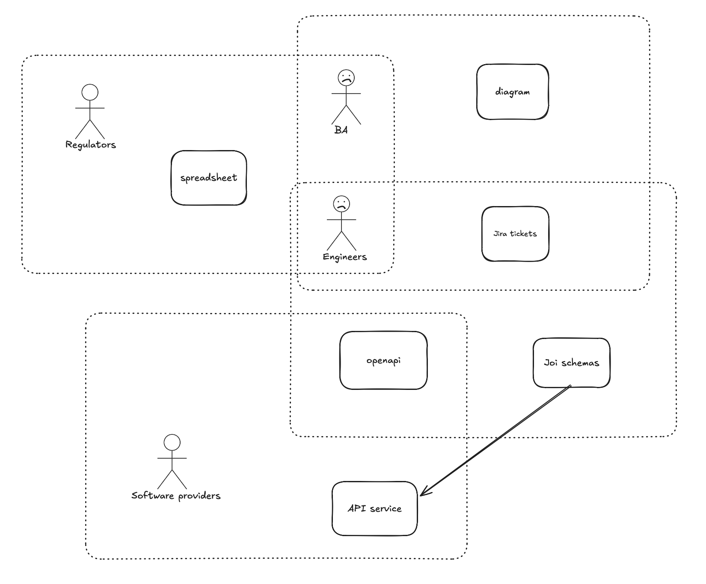
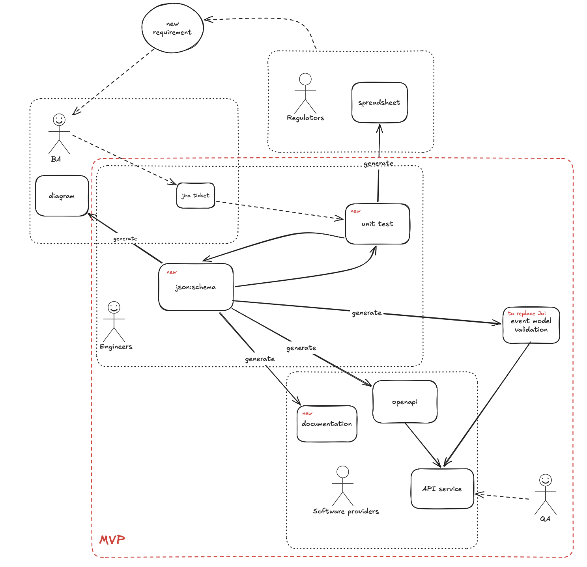

---
search:
  exclude: true
robots: noindex, nofollow
---

# A Process for Event Model Documentation and Distribution

<!-- prettier-ignore -->
!!! warning "Internal documentation"
    This page is internal design/planning material for the delivery team, not published guidance for Software Providers integrating with the Digital Waste Tracking API. Content here may be incomplete, in-progress, or superseded.

## TL;DR

The **event model** is the record of a waste movement that we pass on to the regulators. Today the fields and rules that make it up are written out in five different places, and none of them is the source of truth. This proposes we write each resource **once**, as a JSON Schema file, and generate the rest from it.

- **One file per resource.** `producer`, `carrier`, `address`, and so on. That file is the source of truth.
- **Unit tests sit beside it**, written in plain English, one per business scenario. They pin the rules so a later change cannot quietly break an agreed one.
- **`openapi.yaml` points at the same file.** No second copy to keep in step.
- **The API service validates against the same file.** For the event model this replaces the hand-written Joi schemas; Joi stays where the existing endpoints already use it.
- **First delivery is the schema, the tests, the OpenAPI spec, the validation, and the API service consuming them.** The developer documentation, the business rules spreadsheet and the model diagram can come from the same source later.

## Baseline

### What the event model is

Two things are easy to confuse, so it is worth separating them.

- The **API payload** is what a Software Provider sends us.
- The **event model** is what we send on to the regulators.

They are not the same thing, and we expect them to drift apart as the service grows — a regulator will want something we do not ask a Software Provider for, or the other way round.

**For now we treat them as one shape, by agreement.** Everything in this proposal describes a single set of resources serving both purposes. When the two do need to differ, the work is to split one well-described file into two, which is a far smaller job than reconciling ten loosely-related documents. See [No-gos](#no-gos).

### Where it lives today

The event model already exists. It is just spread out.

| Where the rules live | Who keeps it | What it is for |
| --- | --- | --- |
| Business rules spreadsheet | Business analysis | Agreeing the field list with regulators |
| Model diagrams | Business analysis | Explaining the shape to people |
| Jira tickets | The whole team | Driving the next piece of work |
| `openapi.yaml` | Engineers | The contract we show Software Providers |
| Joi schemas | Engineers | Checking real requests at runtime |

Throughout this page, **the business rules spreadsheet** means that first row — the regulator-facing document listing fields and rules. It is not the waste receipt submission spreadsheet that operators without API access use to send us receipts; that is a different thing entirely, and nothing in this proposal touches it.

Each of these is good at its job. The business rules spreadsheet is how we talk to regulators. The diagram is how we explain a shape to someone who will never open a code editor. The ticket is how work gets picked up.



Only the last row actually runs. When a real request arrives, the Joi schemas decide whether it is accepted. The other four describe what we _intend_. Nothing checks that they still agree with each other, or with the code.

## Problem

**Every rule is written five times.** Adding one field means five edits, by three different people, in three different tools. Miss one and the copies drift apart. Nobody notices until someone asks a question the artefacts answer differently.

**The only true answer is in the code.** If you want to know what the API really accepts, you read the Joi schemas. That rules out most of the people who need the answer — regulators, Software Providers, business analysis, QA.

**The feedback loop with regulators is slow and manual.** We hand over the business rules spreadsheet, wait, take comments back, and then type the result into the other four places by hand.

**The files are too big to work in.** `openapi.yaml` is one file of roughly 2,900 lines. Two people cannot comfortably change it at the same time.

Left alone, this gets worse. Phase 1 covered one event. Phase 2 covers four, sharing most of their resources between them. The cost of keeping five copies honest grows with every event we add.

## Solution

Write each resource once, in a format that is both readable by people and executable by machines, and generate everything else from it.



The picture shows the end state. The rest of this section covers what we build first; **[What this unlocks](#what-this-unlocks)** covers the parts that come later.

### 1. One JSON Schema file per resource

A resource is a thing the event model talks about: a producer, a carrier, an address, a weight. Each one gets its own small file, and files reference each other rather than repeating themselves. A resource with variants gets one file per variant.

Producer is already built this way:

```
docs/event-model/schema/common/producer/
  producer.schema.json             # the choice: household, commercial or municipal
  producer-base.schema.json        # the fields all three share
  producer-household.schema.json
  producer-commercial.schema.json
  producer-municipal.schema.json
```

Every file carries its own description, in prose, next to the rule it describes. Small files also mean two people can work on two resources without touching the same lines.

### 2. Unit tests sit beside the schema

The tests are named after business scenarios, not after code. This is what they look like today:

```
Feature: Producer payload validation for the create endpoint
  Scenario: Household producer is submitted correctly
    the Movement is created successfully when only wasteSource and councilMovement are provided
  Scenario: Household producer includes a forbidden field
    the Movement is rejected when organisationName is provided
```

These read as the rules themselves. That makes them the place where a requirement lands: a ticket says what should happen, the test says it in one line, and the schema is changed until the test passes. A rule that has been agreed stays agreed, because removing it breaks a named test.

### 3. `openapi.yaml` points at the schema

Instead of describing the producer again in the OpenAPI file, it references the schema file:

```yaml
producer:
  $ref: '../event-model/schema/common/producer/producer.schema.json'
```

This is already in place. There is no second copy of the producer rules, so there is nothing to drift.

### 4. Validation runs the same file

The service checks incoming requests against the same schema files, using a JSON Schema validator — `ajv` today, though that choice is not load-bearing (see [Tech Radar and third-party libraries](#tech-radar-and-third-party-libraries)). Nobody re-types the event model's rules into Joi.

The honest limit: a schema describes one resource. A rule that spans two resources, or two endpoints, still lives in service code. This proposal does not change that.

### 5. The API service consumes it

The schema, the validation, the tests and the OpenAPI spec are defined in one repository and consumed by `waste-movement-external-api` and `waste-movement-backend`. This is the part that makes the rest real — a source of truth that the running service does not use is just another document. How the services get hold of it is still open; see [Rabbit holes](#rabbit-holes).

## What changes for us

**Refinement** — we discuss the shape of a resource, rather than the shape of an endpoint. Stories can still be sliced smaller than a resource, down to a single field, when that is the right size.

**A requirement** — is written once, as a named scenario, and that scenario is what the schema has to satisfy.

**A rule change** — is one edit in one file. The spec, the validation and the running service follow from it.

**Review** — the diff shows the rule that changed and the test that pins it, side by side.

**QA** — tests a service whose rules can be read without opening the code.

**Regulators** — keep the same conversation, but the business rules spreadsheet eventually becomes something we generate rather than something we maintain.

## What this unlocks

Not in the first delivery, but possible from the same source, with no new source of truth:

- **Developer documentation** for Software Providers, generated from the schema descriptions.
- **The business rules spreadsheet**, generated read-only, so the field list and the service can never disagree.
- **The model diagram**, generated from how the resources reference each other.

Each of these is a separate piece of work with its own questions. They are named here to show what the approach makes possible, not to commit to them now.

## Rabbit holes

### Tech Radar and third-party libraries

The concern is fair: anything new has to be defensible.

The position is that this **removes** a dependency rather than adding one. Runtime validation moves from `joi` to `ajv`. Neither library appears on the Defra technology radar, so this is not a move from an approved tool to an unapproved one. JSON Schema itself is an open standard, not a product.

The wider intent behind the policy — that any engineer can pick the work up — is served better by this than by the status quo, because the rules end up in a declarative file with prose descriptions rather than in chained library calls.

If a blocker does appear, generating Joi files from the schema is available as a fallback. We should not design for that now.

### Versioning

If one file feeds several outputs, what does a version mean?

The schema files are the version. Everything generated from them carries the same stamp, which is the point: a spreadsheet, a diagram and a running service can all be traced back to one numbered version of the model. Today they cannot be traced to anything.

Whether a change is made in place or carried across two beta versions stays a case-by-case call, unchanged by this proposal. What changes is that there is a single thing to version.

### How the services consume it

This is genuinely undecided, and is the biggest open question in the proposal.

The nearest precedent is `@defra/waste-movement-utils`, a published package that both movement services already depend on at a pinned version. The candidates are:

1. **Its own published package** — clean boundary, another thing to publish and pin.
2. **Folded into `waste-movement-utils`** — reuses a path that already works, at the cost of mixing two concerns in one package.
3. **Schema files fetched from GitHub Pages** — no publishing step, but the services take a build-time or boot-time dependency on a website.

We should pick one before building much beyond Producer, and not let the choice block resource-by-resource progress in the meantime.

## No-gos

- **The live Receipt of Waste endpoints are not touched.** Their code stays as it is.
- **No cross-resource or cross-endpoint rules move into the schema.** They stay in service code.
- **We do not split the event model from the API payload yet.** One shape serves both until there is a real rule that forces them apart.
- **No regulator spreadsheet or diagram generation in the first delivery.** Both are attractive and both are distractions until the core path works end to end.

## References

- [Decisions register](../../collections/decisions.md) — D-002 (single OpenAPI file) and D-003 (OpenAPI 3.0.3) both predate this and will need qualifying notes.
