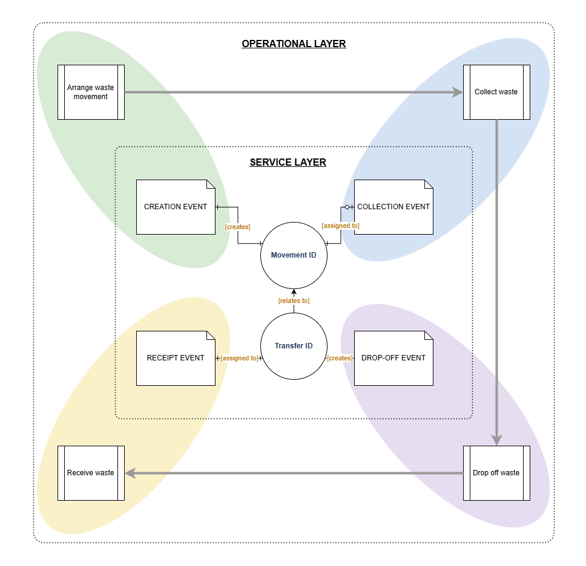

# Digital Waste Tracking: API integration guidance

**Status:** draft outline, v0.1

**Owner:** Dave Oliver

This is a working skeleton for a guidance document to help software providers integrate their systems with the Defra API for recording waste movements. Development and implementation will take place in an agile environment and we welcome the input of software providers to help us develop and refine the integration of the service. 

Section headings and structure are stable; most section bodies are placeholders to be filled in as the API design firms up. [Appendix C](#appendix-c-open-questions-log) includes a list of gaps so far.

## Contents

- [1. Introduction](#1-introduction)
- [2. Service overview](#2-service-overview)
  - [2.1 Lifecycle stages](#21-lifecycle-stages)
  - [2.2 Actors](#22-actors)
  - [2.3 Core entities](#23-core-entities)
- [3. API reference](#3-api-reference)
  - [3.1 Create movement](#31-create-movement)
  - [3.2 Record collection](#32-record-collection)
  - [3.3 Record drop-off](#33-record-drop-off)
  - [3.4 Record receipt](#34-record-receipt)
  - [3.5 General conventions](#35-general-conventions)
- [4. Business rules and data reconciliation](#4-business-rules-and-data-reconciliation)
  - [4.1 Collection cardinality](#41-collection-cardinality)
  - [4.2 Movement-to-transfer cardinality](#42-movement-to-transfer-cardinality)
  - [4.3 Timing rules](#43-timing-rules)
- [5. Testing and conformance](#5-testing-and-conformance)
- [Appendix A: glossary](#appendix-a-glossary)
- [Appendix B: endpoint quick reference](#appendix-b-endpoint-quick-reference)
- [Appendix C: open questions log](#appendix-c-open-questions-log)

---

## 1. Introduction

This document provides guidance for software providers building producer, broker, carrier/driver or receiver-facing systems that will interact with Defra's dedicated API to record waste movements. 

Digital Waste Tracking (DWT) is a UK cross-government programme to build a single digital service for tracking waste movements, ultimately replacing paper-based waste transfer records. Its main aims are to reduce waste crime and misclassification, improve data on how waste moves domestically to support the transition to a circular economy, and cut the administrative burden of the current fragmented, paper-based system.

The current focus of the DWT development team is to reach the first 'development milestone' of the service (Aug/Sep 2026) - to test API interactions in a sandbox environment and use the findings to better refine the service for rollout. The scope of this document is there focused on the integration API only, rather than the overall DWT service, which will follow. 

<br>

## 2. Service overview



### 2.1 Lifecycle stages
The API is organised around four stages

| Stage | What happens |
|---|---|
| Creation | Movement created; estimated details declared; Movement ID generated |
| Collection | Carrier/driver records the collection against a Movement ID |
| Drop-off | Driver records drop-off and declares the Movement ID in scope; Transfer ID generated |
| Receipt | Receiving site records acceptance of the waste against the Transfer ID |

### 2.2 Actors
- **Producer / Controller** – the organisation whose waste is being moved
- **Broker / Controller** – arranges the movement on behalf of a producer or receiver
- **Carrier / Transporter** – the organisation licensed to transport the waste; may operate through a **Driver** as the field-level user recording events in real time
- **Receiver** – the site accepting the waste for treatment, disposal or recovery

### 2.3 Core entities
- **Waste Movement ID** – the primary record of an intended waste movement, created before the waste moves
- **Waste Transfer ID** – the record created at drop-off; a single Transfer ID can bundle one or more Movement IDs together

<br>

## 3. API reference

These endpoints are structured by lifecycle stage rather than by resource, so they read in the same order a movement actually happens. The endpoint summaries below may not always be current, so be sure to use the definitive source for exact paths, request and response schemas: [Digital Waste Tracking OpenAPI specification](https://github.com/DEFRA/digital-waste-tracking-api-docs/blob/main/docs/api/openapi.yaml).

The spec is in alpha and still changing. Expect some shapes to shift before go-live.

The original Phase 1 receipt endpoints still work. They're marked deprecated, not removed, so existing integrations keep running while the fuller model is built alongside them.

To explore requests and responses before you build, preview the YAML in [Swagger Editor](https://editor.swagger.io) or a VS Code OpenAPI extension.

The examples in 3.1 to 3.4 follow a single movement end to end: a hazardous consignment of mercury-containing fluorescent tubes, created, collected, dropped off and received. The Movement ID minted at creation is reused throughout so you can see how the four stages connect – in practice, every real movement mints its own IDs.

### 3.1 Create movement

| | |
|---|---|
| **Endpoints** | `POST /movements/create`, `PUT /movements/{id}/create`, `DELETE /movements/create` |
| **Input** | Waste classification, producer details, estimated collection details, estimated receiver details, estimated carrier details, broker details |
| **Output** | Validation result, Waste Movement ID |

This example is a hazardous movement, which is why `hazardousWasteConsignmentCode`, `hazardous` and `receiver` are all present – none of the three is required for a non-hazardous movement.

**Example:**
```json
{
  "apiCode": "25b14080-5e77-4f91-9957-2482a0cb8775",
  "estimatedDateTimeCollected": "2025-09-15T08:00:00Z",
  "hazardousWasteConsignmentCode": "CJ123E/A0001",
  "producer": {
    "wasteSource": "Commercial",
    "organisationName": "ACME Waste Producers Ltd",
    "authorisationNumber": "EAS/P/123456",
    "sicCode": "38110",
    "address": {
      "fullAddress": "10 Industrial Way, Test City",
      "postcode": "TE1 2PQ"
    },
    "councilMovement": false
  },
  "carrier": {
    "meansOfTransport": "Road",
    "registrationNumber": "CBDU123456",
    "organisationName": "Test Carrier Ltd",
    "vehicleRegistration": "AB12 CDE"
  },
  "receiver": {
    "siteName": "Test Receiver Site",
    "authorisationNumber": "HP3456XX",
    "address": {
      "fullAddress": "99 Receiver Road, Test City",
      "postcode": "TE1 3RX"
    }
  },
  "wasteItems": [
    {
      "ewcCodes": [
        "200121"
      ],
      "wasteDescription": "Fluorescent tubes (mercury)",
      "physicalForm": "Solid",
      "numberOfContainers": 4,
      "typeOfContainers": "SKI",
      "weight": {
        "metric": "Tonnes",
        "amount": 0.5,
        "isEstimate": true
      },
      "containsPops": true,
      "pops": {
        "sourceOfComponents": "PROVIDED_WITH_WASTE"
      },
      "containsHazardous": true,
      "hazardous": {
        "sourceOfComponents": "GUIDANCE",
        "hazCodes": [
          "HP_4"
        ],
        "components": [
          {
            "name": "Mercury",
            "concentration": 5
          }
        ]
      },
      "disposalOrRecoveryCodes": [
        {
          "code": "R1",
          "weight": {
            "metric": "Tonnes",
            "amount": 0.5,
            "isEstimate": true
          }
        }
      ]
    }
  ]
}
```

**Response:**
```json
{
  "movementId": "25HRA0B2",
  "validation": {
    "warnings": []
  }
}
```

### 3.2 Record collection
Real-time STATIC pickup (producer to driver).

| | |
|---|---|
| **Endpoints** | `POST /movements/static-collection` |
| **Input** | Waste Movement ID, collection dateTime, carrier details, collection address |
| **Output** | Validation result |

Each physical collection is recorded as a separate entry – there's no requirement to model consolidation where multiple loads are later combined.

Recorded against Movement ID `25HRA0B2` from the creation response above – the Movement ID is supplied in the URL, not the request body.

**Example:**
```json
{
  "apiCode": "25b14080-5e77-4f91-9957-2482a0cb8775",
  "actualDateTimeCollected": "2025-09-15T08:34:00Z",
  "yourUniqueReference": "DRIVER-TRIP-001",
  "carrier": {
    "meansOfTransport": "Road",
    "registrationNumber": "CBDU123456",
    "organisationName": "Test Carrier Ltd",
    "vehicleRegistration": "AB12 CDE"
  },
  "collection": {
    "address": {
      "fullAddress": "10 Industrial Way, Test City",
      "postcode": "TE1 2PQ"
    }
  }
}
```

The response is a validation envelope only; no new identifier is returned, so the walkthrough continues to use the same Movement ID.

### 3.3 Record drop-off
Single-movement drop-off – required here because this movement is hazardous.

| | |
|---|---|
| **Endpoints** | `POST /movements/drop-off` |
| **Input** | Drop-off dateTime, drop-off address, one or more Movement IDs, carrier details |
| **Output** | Validation result, Waste Transfer ID |

Hazardous waste cannot be aggregated across movements: if any linked Movement is hazardous, `movementIds` must contain exactly one ID. Non-hazardous movements can be consolidated into a single drop-off with more than one ID – see [4.2 Movement-to-transfer cardinality](#42-movement-to-transfer-cardinality).

**Example:**
```json
{
  "apiCode": "25b14080-5e77-4f91-9957-2482a0cb8775",
  "movementIds": [
    "25HRA0B2"
  ],
  "actualDateTimeDropOff": "2025-09-15T11:15:00Z",
  "yourUniqueReference": "DRIVER-RUN-AM-001",
  "carrier": {
    "meansOfTransport": "Road",
    "registrationNumber": "CBDU123456",
    "organisationName": "Test Carrier Ltd",
    "vehicleRegistration": "AB12 CDE"
  },
  "dropOff": {
    "siteName": "Test Drop-off Site",
    "address": {
      "fullAddress": "99 Receiver Road, Test City",
      "postcode": "TE1 3RX"
    }
  }
}
```

**Response:**
```json
{
  "transferId": "25HRA0B2",
  "validation": {
    "warnings": []
  }
}
```

For a hazardous single-movement drop-off, the returned Transfer ID is the same as the Movement ID – nothing new is minted. A non-hazardous multi-movement drop-off mints a fresh Transfer ID instead.

**Non-hazardous variant:** when none of the linked movements are hazardous, a single drop-off can consolidate more than one Movement ID – for example, two non-hazardous movements collected on the same run and dropped off together (assume `25TKP3C9` and `25ZWQ7D1` were each already created and collected, following the same pattern as 3.1 and 3.2):

```json
{
  "apiCode": "25b14080-5e77-4f91-9957-2482a0cb8775",
  "movementIds": [
    "25TKP3C9",
    "25ZWQ7D1"
  ],
  "actualDateTimeDropOff": "2025-09-15T14:45:00Z",
  "yourUniqueReference": "DRIVER-RUN-PM-002",
  "carrier": {
    "meansOfTransport": "Road",
    "registrationNumber": "CBDU123456",
    "organisationName": "Test Carrier Ltd",
    "vehicleRegistration": "AB12 CDE"
  },
  "dropOff": {
    "siteName": "Test Drop-off Site",
    "address": {
      "fullAddress": "99 Receiver Road, Test City",
      "postcode": "TE1 3RX"
    }
  }
}
```

This mints a fresh Transfer ID, unlike the hazardous single-movement case above.

### 3.4 Record receipt

| | |
|---|---|
| **Endpoints** | `POST /movements/receive` |
| **Input** | Waste Transfer ID, waste item details, receiver details, carrier details, broker details |
| **Output** | Validation result |

Recorded against Transfer ID `25HRA0B2` from the drop-off response above. The waste item here carries the actual, confirmed weight and treatment – compare `weight.isEstimate` and `disposalOrRecoveryCodes` against the estimates declared at creation in 3.1.

**Example:**
```json
{
  "apiCode": "8f2c1a90-6b3e-4c1d-9a55-1e7f4b8d2c31",
  "dateTimeReceived": "2025-09-15T12:30:00Z",
  "hazardousWasteConsignmentCode": "CJ123E/A0001",
  "yourUniqueReference": "RECEIPT-CHECK-001",
  "carrier": {
    "meansOfTransport": "Road",
    "registrationNumber": "CBDU123456",
    "organisationName": "Test Carrier Ltd",
    "vehicleRegistration": "AB12 CDE"
  },
  "receiver": {
    "siteName": "Test Receiver Site",
    "authorisationNumber": "HP3456XX"
  },
  "receipt": {
    "address": {
      "fullAddress": "99 Receiver Road, Test City",
      "postcode": "TE1 3RX"
    }
  },
  "wasteItems": [
    {
      "ewcCodes": [
        "200121"
      ],
      "wasteDescription": "Fluorescent tubes (mercury)",
      "physicalForm": "Solid",
      "numberOfContainers": 4,
      "typeOfContainers": "SKI",
      "weight": {
        "metric": "Tonnes",
        "amount": 0.48,
        "isEstimate": false
      },
      "containsPops": true,
      "pops": {
        "sourceOfComponents": "PROVIDED_WITH_WASTE"
      },
      "containsHazardous": true,
      "hazardous": {
        "sourceOfComponents": "GUIDANCE",
        "hazCodes": [
          "HP_4"
        ],
        "components": [
          {
            "name": "Mercury",
            "concentration": 5
          }
        ]
      },
      "disposalOrRecoveryCodes": [
        {
          "code": "R1",
          "weight": {
            "metric": "Tonnes",
            "amount": 0.48,
            "isEstimate": false
          }
        }
      ]
    }
  ]
}
```

### 3.5 General conventions

- Environments and base URLs (sandbox/production) – *TBC*
- API versioning and deprecation policy – *TBC*
- Standard error response shape and status codes – *TBC*
- Idempotency behaviour on retries – *TBC*
- Rate limits and pagination – *TBC*

<br>

## 4. Business rules and data reconciliation

### 4.1 Collection cardinality
One collection entry per physical collection event, even where loads are later combined at drop-off.

### 4.2 Movement-to-transfer cardinality
Many Movement IDs can be linked to a single Transfer ID at drop-off; a Transfer ID always originates from exactly one drop-off event.

### 4.3 Timing rules
- Time limits, if any, for deferred/retrospective collection and receipt recording – *TBC*
- Whether a Movement can be deleted/cancelled after collection has started – *TBC*

<br>

## 5. Testing and conformance

- Sandbox scenarios covering each of the four endpoint groups in [section 3](#3-api-reference)
- Reference test data, including chained Movement ID → Transfer ID scenarios and hazardous/POPs edge cases
- Conformance or certification process ahead of production access – *TBC*

<br>

## Appendix A: glossary

| Term | Meaning |
|---|---|
| DWT | Digital Waste Tracking – the digital service this API supports |
| EWC | European Waste Catalogue – the code list used to classify waste type |
| HWCN | Hazardous Waste Consignment Note – the paper record DWT replaces for hazardous waste |
| POPs | Persistent organic pollutants – chemicals subject to additional handling and reporting rules |
| Waste Movement ID | Identifier issued when a movement is created, before waste moves |
| Waste Transfer ID | Identifier issued at drop-off; can link multiple Movement IDs together |
| WTN | Waste Transfer Note – the paper record DWT replaces for non-hazardous waste |


## Appendix B: endpoint quick reference

| Method | Path |
|---|---|
| POST | `/movements/create` |
| PUT | `/movements/{id}/create` |
| DELETE | `/movements/create` |
| POST | `/movements/static-collection` |
| POST | `/movements/transit-collection` |
| POST | `/movements/drop-off` |
| POST | `/movements/{id}/drop-off` |
| POST | `/movements/receive` |
| PUT | `/movements/{id}/receive` |


## Appendix C: open questions log

| # | Question | Raised |
|---|---|---|
| 1 | How is the accept/reject/partial-accept decision at receipt represented in the `receive` request or response? Only a generic validation result is currently defined as output | 2026-08-13 |
| 2 | Are there time limits on deferred/retrospective collection or receipt recording? | 2026-08-13 |
| 3 | Can a Movement be deleted or cancelled once collection has started? | 2026-08-13 |
| 4 | What authentication mechanism does the API use (OAuth2/OIDC, API key, or other)? | 2026-08-13 |
| 5 | Is there a conformance or certification process for software providers before production access is granted? | 2026-08-13 |
| 6 | Can we add step-by-step guidance for a sample API integration? | 2026-08-18 |
| 7 | What's the process for onboarding of software providers and how will they gain test credentials? | 2026-08-18 |
| 8 | Do we require more detailed business rules? | 2026-08-18 |
