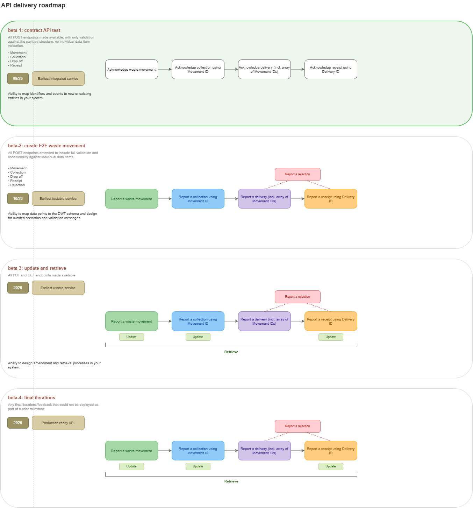
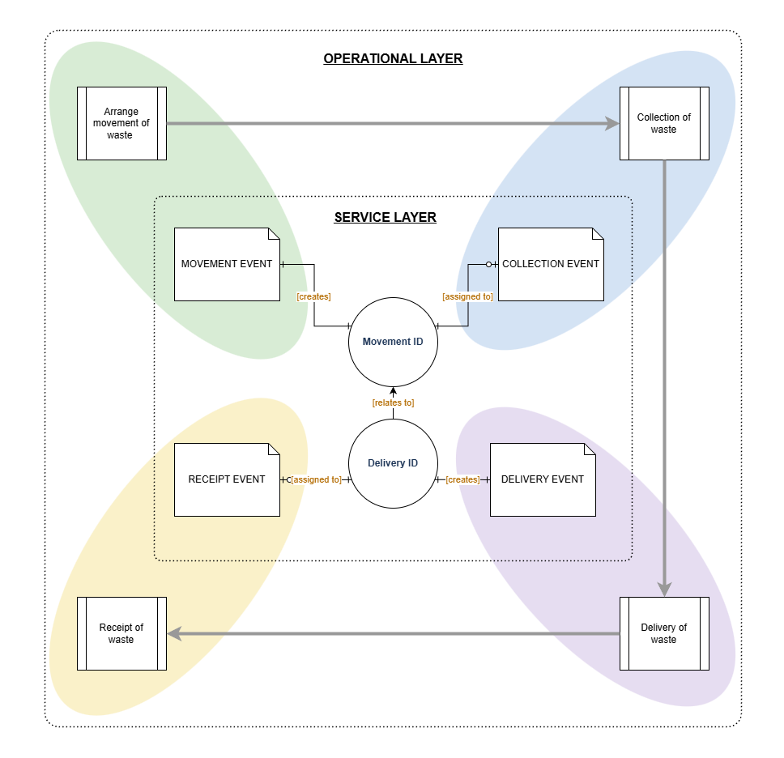

# Digital Waste Tracking: API integration guidance

**Status:** draft outline, v0.1

**Owner:** Dave Oliver

## Contents

- [1. Introduction](#1-introduction)
- [2. What's changing from today's process](#2-whats-changing-from-todays-process)
- [3. Service overview](#3-service-overview)
  - [3.1 Lifecycle stages](#31-lifecycle-stages)
  - [3.2 Actors](#32-actors)
  - [3.3 Core identifiers](#33-core-identifiers)
- [4. API reference](#4-api-reference)
- [5. Business rules and data reconciliation](#5-business-rules-and-data-reconciliation)
  - [5.1 Collection cardinality](#51-collection-cardinality)
  - [5.2 Movement-to-delivery cardinality](#52-movement-to-delivery-cardinality)
- [6. Testing and conformance](#6-testing-and-conformance)
- [Appendix A: glossary](#appendix-a-glossary)
- [Appendix B: endpoint quick reference](#appendix-b-endpoint-quick-reference)

---

## 1. Introduction

**Purpose of document:** This document provides guidance for software providers building producer, broker, carrier/driver or receiver-facing systems that will interact with Defra's dedicated API to record waste movements.

**Service background:** Digital Waste Tracking (DWT) is a UK cross-government programme to build a single digital service for tracking waste movements, ultimately replacing paper-based waste transfer notes (WTNs). Its main aims are to reduce waste crime and misclassification, improve data on how waste moves domestically to support the transition to a circular economy, and cut the administrative burden of the current fragmented, paper-based system.

**Current status:** The current focus of the DWT development team is to reach the first development milestone (beta-1) of the service (Sep 2026) - to test API interactions in a sandbox environment and use the findings to better refine the service for rollout. The scope of this document is therefore focused on the integration API only, rather than the overall DWT service, which will follow. While the overall concept and rollout timetable are approved, some coding and naming elements may evolve as the development progresses.

****

 

## 2. What's changing from today's process

Today, non-hazardous waste movements are recorded on a paper Waste Transfer Note (WTN); hazardous movements use a paper Hazardous Waste Consignment Note (HWCN). DWT replaces both with a single digital record, built up through API calls from each party as the waste moves.

| Today (paper WTN/HWCN) | With DWT |
| --- | --- |
| One physical document per movement, completed and passed from party to party | Four separate events – creation, collection, delivery, receipt – each recorded through the API by the party responsible for it |
| No shared reference number linking the copies each party holds | A Movement ID (and Delivery ID) issued by the service and used by every party across the whole journey |
| Reconciling what was collected against what was delivered is a manual, after-the-fact exercise | The service applies reconciliation rules – such as [movement-to-delivery cardinality](#52-movement-to-delivery-cardinality) – as each event is submitted |
| Waste classification and hazard details recorded as free text on paper | The same details captured as structured, validated API fields (EWC codes, hazardous and POPs flags) |
| Data stays in separate paper trails, hard to link or analyse across the system | Movement data is captured once, in one service, and can be linked end-to-end – supporting DWT's aims of reducing waste crime and misclassification, and improving data on domestic waste movements |

For software providers, the practical implication is: build for structured, event-based recording, not for reproducing a WTN or HWCN as a single document. Each actor's system calls the endpoint for the event it's responsible for – see [section 3](#3-service-overview) for how the four events fit together.

 

## 3. Service overview

### 3.1 Lifecycle stages

The API is organised around four stages:

| Stage | What happens |
| --- | --- |
| Creation | Movement created; estimated details declared; Movement ID generated |
| Collection | Carrier/driver records the collection against a Movement ID |
| Delivery | Driver records delivery and declares the Movement ID in scope; Delivery ID generated |
| Receipt | Receiving site records acceptance of the waste against the Delivery ID |

### 3.2 Actors

- **Producer / Controller (EA term)** – the organisation whose waste is being moved
- **Broker / Controller (EA term)** – arranges the movement on behalf of a producer or receiver
- **Carrier / Transporter (EA term)** – the organisation licensed to transport the waste; may operate through a **Driver** as the field-level user recording events in real time
- **Receiver** – the site accepting the waste for treatment, disposal or recovery

### 3.3 Core identifiers

- **Waste Movement ID** – `movementId` is the primary record of an intended waste movement, created before the waste moves
- **Waste Delivery ID** – `deliveryId` is the record created at delivery; a single Delivery ID can bundle one or more Movement IDs together

 

## 4. API reference

You can see the current API spec at: [Digital Waste Tracking OpenAPI specification](api/openapi-beta-1.md).

The spec will update with each milestone in the development process – expect some shapes to shift before go-live.

 

## 5. Business rules and data reconciliation

### 5.1 Collection cardinality

One collection entry per physical collection event, even where loads are later combined at delivery.

### 5.2 Movement-to-delivery cardinality

Many Movement IDs can be linked to a single Delivery ID at delivery; a Delivery ID always originates from exactly one delivery event.

 

## Appendix A: glossary

| Term | Meaning |
| --- | --- |
| DWT | Digital Waste Tracking – the digital service this API supports |
| EA | Environment Agency |
| EWC | European Waste Catalogue – the code list used to classify waste type |
| HWCN | Hazardous Waste Consignment Note – the paper record DWT replaces for hazardous waste |
| POPs | Persistent organic pollutants – chemicals subject to additional handling and reporting rules |
| Waste Movement ID | Identifier issued when a movement is created, before waste moves |
| Waste Delivery ID | Identifier issued at delivery; can link multiple Movement IDs together |
| WTN | Waste Transfer Note – the paper record DWT replaces for non-hazardous waste |

## Appendix B: endpoint quick reference

| Method | Path                                 |
| ------ | ------------------------------------ |
| POST   | `/movements`                         |
| POST   | `/movements/{movementId}/collection` |
| POST   | `/deliveries`                        |
| POST   | `/deliveries/{deliveryId}/receipt`   |
